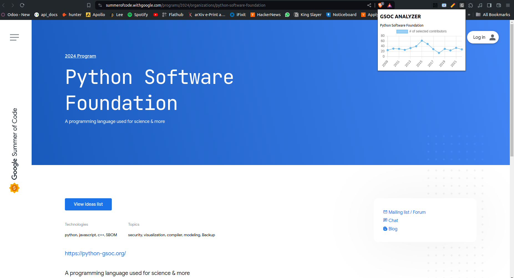

# gsoc-analyzer
[Chrome Extension Link](https://chromewebstore.google.com/detail/gsoc-analyzer/gajaljimiohdjebdgganepkpihdhlmic) 
[Firefox Extension Link](https://addons.mozilla.org/en-US/firefox/addon/gsoc-analyzer/?utm_source=gsoc.mdgspace.org)
## How to use it? 

1. Open Gsoc orgs browsing page. [LINK](https://summerofcode.withgoogle.com/programs/2024/organizations)
2. Go to any ORG's page.
3. Click on the our ICON.
4. Stats like shown below will be visible





## Want to Contribute?
#### steps for setup

1. Clone the Repository
2. Give the file execution access `chmod +x ./tools/build.sh`
3. To build for specific browser use following commands
```
// for Chrome

$ ./tools/build.sh chrome

// for FireFox

$ ./tools/build.sh firefox

```

4. Unpack the extension in your browser. If you don't know how to, see [this](https://community.brave.com/t/debugging-custom-extension-add-ons/169217/3)
5. After load unpacked, select the dist/chrome folder or other folder if your are using firefox


